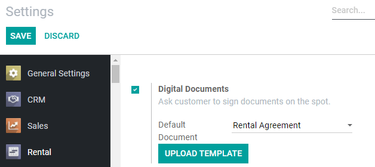

======
Rental
======

**Odoo Rental** is a comprehensive solution to manage your rentals.

From a single view, you can send out quotations, confirm orders, schedule rentals, register when
products are picked up and returned, and invoice your customers.

.. seealso::
   - `Odoo Rental: product page <https://www.odoo.com/app/rental>`_

Configuring rental pricing
==========================

Go to :menuselection:`Rental --> Products`, select or create a product, and click on the
product's *Rental tab*. Under *Rental Pricing*, click on *Add a price*. Then you choose a *Unit*
of time (hours, days, weeks, or months), a *Duration*, and a *Price*. You can add as many price
lines as necessary, usually to give out discounts for longer rental durations.

.. image:: rental/rental-pricing-example.png
   :align: center
   :alt: Example of rental pricing configuration in Odoo Rental

.. tip::
   Under *Reservations*, you can add fines for any *Extra Hour* or *Extra Day*. It's also here you
   can set a *Security Time*, expressed in hours, to make the product temporarily unavailable
   between two rental orders.

Computing rental pricing
------------------------

Odoo uses two rules to compute the price of a product when you create a rental order:

#. It only ever uses one price line.
#. It selects the cheapest line.

Consider the following rental pricing configuration for a product:

- 1 day: $100
- 3 days: $250
- 1 week: $500

If you create an order for 8 days, Odoo will select the second line as it is the cheapest option
given both rules: it will add 3 times '3 days' to cover the 8 days for a total of $750, even if
it would be cheaper to mix lines (1 day for $100 + 1 week for $500). In this scenario, if you
want to make sure your customers always get the best price, you need to configure more price lines.

Requesting a customer signature
===============================

You can ask your customers to sign a rental agreement before they pick up products. Go to
:menuselection:`Rental --> Configuration --> Settings`, activate *Digital Documents*
and *Save*.

.. note::
   This feature requires the *Sign* app. If necessary, Odoo will install it after activating
   *Digital Documents*.

Once the app settings are saved, you have the option to change the default *Rental Agreement*. You
can pick any document already used with the *Sign* app, or upload a new one by clicking on
*Upload Template*.

To request a customer signature, select a confirmed rental order, click on *Sign Documents*,
choose the document template and click on *Sign Documents* again. On the next window, select your
customer and click on *Sign Now* to start the signing process with your customer. Once the
document is completed, click on *Validate & Send Completed Document*.

Printing a Pickup and Return receipt
====================================

You can print and give your customers *Pickup and Return* receipts. To do so, open any rental
order, click on *Print* and select *Pickup and Return Receipt*. Odoo then generates a PDF file
detailing all information about the current status of the rented items: which were picked up,
when they were expected to be returned, which were returned, and potential rental delay costs.

.. image:: rental/print-receipt.png
   :align: center
   :alt: Printing a Pickup and Return receipt in Odoo Rental